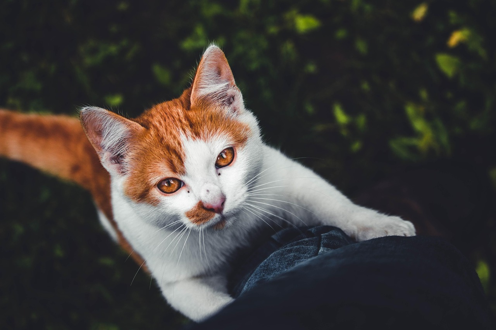

# Pablo Ruiz Soria
Bienvenido a mi presentación. Soy Pablo Ruiz Soria, un apasionado de la tecnología y el desarrollo de software. A lo largo de mi carrera, he trabajado en diversos proyectos que me han permitido adquirir experiencia en diferentes áreas del desarrollo web y móvil.
A continuación, te invito a conocer más sobre mi trayectoria profesional, mis habilidades y los proyectos en los que he participado. Espero que esta presentación te brinde una visión clara de quién soy y cómo puedo contribuir a tu equipo o proyecto.
## Aficiones
Además de mi pasión por la tecnología, tengo varias aficiones que me ayudan a mantener un equilibrio en mi vida personal y profesional. Entre ellas se encuentran: 
- **Lectura:** Disfruto leer libros de ciencia ficción y tecnología, lo que me permite mantenerme actualizado con las últimas tendencias y avances en el mundo digital.
- **Deporte:** Me gusta practicar deportes al aire libre, como el senderismo y el ciclismo, que me ayudan a mantenerme activo y saludable.
- **Música:** Toco la guitarra en mi tiempo libre, lo que me permite expresar mi creatividad y relajarme después de un día de trabajo.
- **Viajes:** Me encanta viajar y conocer nuevas culturas, lo que me brinda una perspectiva más amplia del mundo y me inspira en mi trabajo diario.
## Contacto
Si deseas ponerte en contacto conmigo, no dudes en enviarme un correo electrónico a

